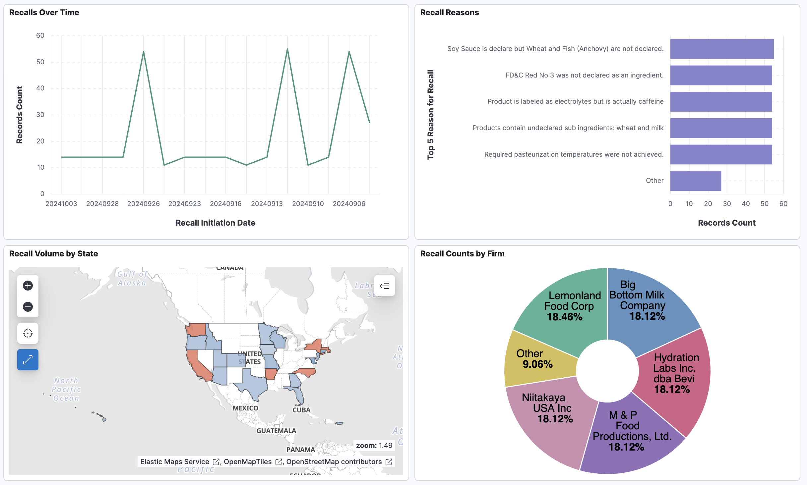

# Automated ETL Pipeline Using ELK, Docker and Jenkins 🚀

This project is an automated ETL pipeline that extracts, transforms, and loads (ETL) FDA food recall data into Elasticsearch, using Docker, Logstash, and Jenkins for scheduling and continuous integration. The data is visualized in Kibana for analysis and monitoring.

## Overview 📝

The pipeline fetches FDA food recall data for the previous month through the FDA's [OpenFDA API](https://api.fda.gov/food/enforcement.json) and loads it into an Elasticsearch index (`fda_recalls`). This data is then visualized and monitored in Kibana. The project is configured to run automatically on the first day of each month.

## Configuration Details ⚙️

### Logstash Configuration (`logstash.conf`)

The configuration file defines the following:
1. **Data Input**: Polls the FDA API once a month to retrieve data for the previous month.
2. **Data Transformation**: Converts date fields to `YYYYMMdd` format, assigns default values, and removes unused fields.
3. **Data Output**: Stores transformed data in the `fda_recalls` index within Elasticsearch.

### Docker Compose (`docker-compose.yml`)

- **Elasticsearch**: Stores FDA data.
- **Kibana**: Visualizes the FDA data from Elasticsearch.
- **Logstash**: Fetches and processes FDA data.

### Jenkins Pipeline (`Jenkinsfile`)

1. **Checkout Code**: Pulls the latest version of the project from the GitHub repository.
2. **Set Date for API Call**: Runs `set_dates.sh` to define the date range for data extraction.
3. **Stop Existing Containers**: Shuts down any running Docker containers.
4. **Start Docker Services**: Brings up all containers (Logstash, Elasticsearch, and Kibana).
5. **Process Data**: Monitors data processing in Logstash, ensuring data flows correctly.

### Shell Script (`set_dates.sh`)

This script calculates the start and end dates for the previous month and sets these as environment variables (`PREVIOUS_MONTH_START` and `PREVIOUS_MONTH_END`) for Logstash.

## Results 📊
- **Successful Data Retrieval**: The pipeline successfully fetches FDA food recall data from the OpenFDA API on a monthly basis.
- **Data Transformation**: Dates are accurately formatted, and unused fields are removed, ensuring clean and structured data.
- **Data Storage & Visualization**: The processed data is stored in Elasticsearch, and the Kibana dashboard provides clear visual insights into the food recall data.
- **Automated Workflow**: The entire ETL process (data extraction, transformation, loading) is automated, reducing manual intervention and ensuring up-to-date data each month.
- **CI/CD Pipeline**: The use of Jenkins guarantees smooth continuous integration and deployment, streamlining the entire data pipeline workflow.

## Conclusion 🏁
This **FDA Food Recall Data Pipeline** has successfully automated the process of extracting, transforming, and loading FDA recall data into Elasticsearch. By leveraging Docker, Logstash, Jenkins, and Kibana, the pipeline not only automates data processing but also ensures data accuracy and visualization, which enhances monitoring and decision-making.

- The pipeline’s automation improves data flow, reduces errors.
- The integration of CI/CD practices via Jenkins ensures that the process remains scalable and efficient for future data updates.
- Overall, this solution enhances food safety monitoring by providing timely and actionable data through visual dashboards, ultimately contributing to public health efforts.
